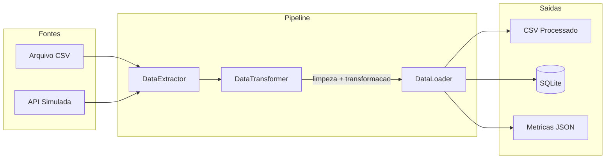
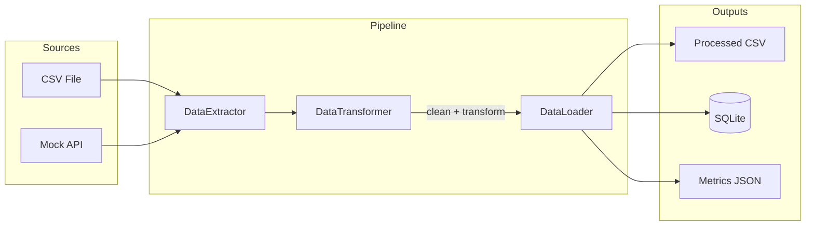

# Modern ETL Pipeline

[](https://www.python.org/)
[](https://pandas.pydata.org/)
[](https://numpy.org/)
[](LICENSE)

[Portugues](#portugues) | [English](#english)

---

## Portugues

### Visao Geral

Pipeline ETL escrito em Python com um unico arquivo-fonte (`etl_pipeline.py`, ~387 linhas).
Extrai dados de arquivos CSV e de uma API simulada, aplica limpeza e transformacao, e carrega os resultados em CSV e SQLite.

**Classes principais:**

| Classe | Responsabilidade |
|--------|-----------------|
| `DataExtractor` | Le arquivos CSV e gera dados mock de API |
| `DataTransformer` | Remove duplicatas, preenche nulos, remove outliers (IQR), adiciona colunas calculadas (categorias de preco, timestamp) |
| `DataLoader` | Grava resultados em CSV e SQLite |
| `ETLPipeline` | Orquestra extract, transform, load e registra metricas em JSON |

### Arquitetura



### Inicio Rapido

```bash
# Clonar o repositorio
git clone https://github.com/galafis/Modern-ETL-Pipeline.git
cd Modern-ETL-Pipeline

# Criar e ativar ambiente virtual
python -m venv venv
source venv/bin/activate  # Windows: venv\Scripts\activate

# Instalar dependencias
pip install -r requirements.txt

# Executar o pipeline
python etl_pipeline.py

# Executar com agendamento (opcional, via biblioteca schedule)
python etl_pipeline.py --schedule
```

### Estrutura do Projeto

```
Modern-ETL-Pipeline/
├── etl_pipeline.py      # Codigo-fonte principal
├── requirements.txt     # Dependencias (pandas, numpy, pyyaml, schedule, pytest)
├── tests/
│   ├── __init__.py
│   └── test_main.py     # Testes funcionais
├── LICENSE
└── README.md
```

### Testes

```bash
pytest tests/ -v
```

### Tecnologias

| Tecnologia | Uso |
|------------|-----|
| Python | Linguagem principal |
| pandas | Manipulacao de dados |
| NumPy | Operacoes numericas |
| PyYAML | Leitura de configuracao YAML (opcional) |
| schedule | Agendamento de execucao (opcional) |
| pytest | Testes |

### Licenca

Licenciado sob a Licenca MIT - veja o arquivo [LICENSE](LICENSE).

### Autor

**Gabriel Demetrios Lafis**
- GitHub: [@galafis](https://github.com/galafis)
- LinkedIn: [Gabriel Demetrios Lafis](https://linkedin.com/in/gabriel-demetrios-lafis)

---

## English

### Overview

ETL pipeline written in Python with a single source file (`etl_pipeline.py`, ~387 lines).
Extracts data from CSV files and a mock API, applies cleaning and transformation, and loads the results into CSV and SQLite.

**Core classes:**

| Class | Responsibility |
|-------|---------------|
| `DataExtractor` | Reads CSV files and generates mock API data |
| `DataTransformer` | Removes duplicates, fills nulls, removes outliers (IQR), adds calculated columns (price categories, timestamp) |
| `DataLoader` | Writes results to CSV and SQLite |
| `ETLPipeline` | Orchestrates extract, transform, load and logs metrics to JSON |

### Architecture



### Quick Start

```bash
# Clone the repository
git clone https://github.com/galafis/Modern-ETL-Pipeline.git
cd Modern-ETL-Pipeline

# Create and activate virtual environment
python -m venv venv
source venv/bin/activate  # Windows: venv\Scripts\activate

# Install dependencies
pip install -r requirements.txt

# Run the pipeline
python etl_pipeline.py

# Run with scheduling (optional, via schedule library)
python etl_pipeline.py --schedule
```

### Project Structure

```
Modern-ETL-Pipeline/
├── etl_pipeline.py      # Main source code
├── requirements.txt     # Dependencies (pandas, numpy, pyyaml, schedule, pytest)
├── tests/
│   ├── __init__.py
│   └── test_main.py     # Functional tests
├── LICENSE
└── README.md
```

### Tests

```bash
pytest tests/ -v
```

### Technologies

| Technology | Usage |
|------------|-------|
| Python | Core language |
| pandas | Data manipulation |
| NumPy | Numerical operations |
| PyYAML | YAML config reading (optional) |
| schedule | Execution scheduling (optional) |
| pytest | Testing |

### License

Licensed under the MIT License - see [LICENSE](LICENSE).

### Author

**Gabriel Demetrios Lafis**
- GitHub: [@galafis](https://github.com/galafis)
- LinkedIn: [Gabriel Demetrios Lafis](https://linkedin.com/in/gabriel-demetrios-lafis)
